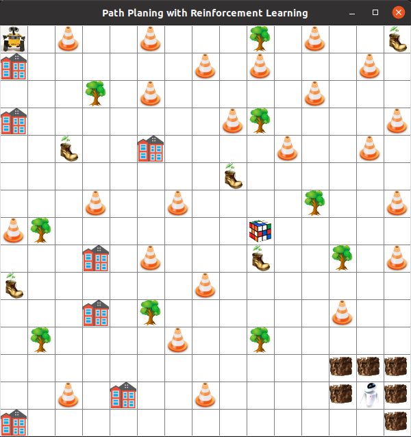
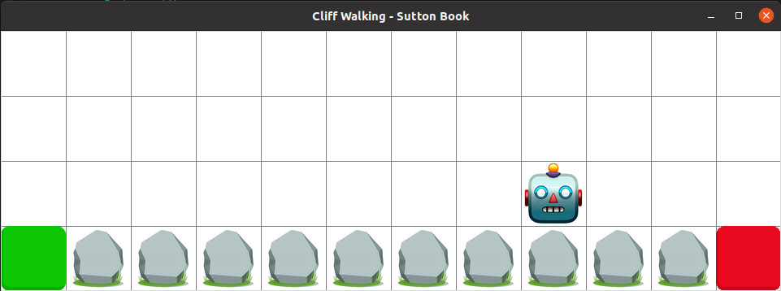
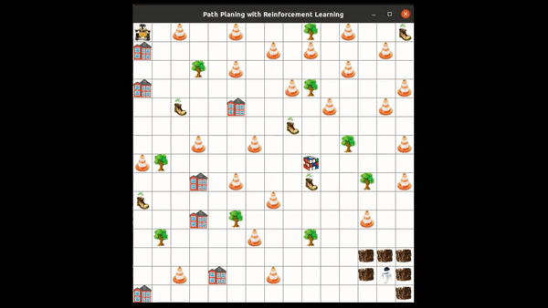

# Global Path Planning with Reinforcement Learning Algorithms to Help the WALL-E Robot Reach EVE!

## About the Project

### Introduction

This project aims to test various reinforcement learning (RL) algorithms for the global path planning of a mobile robot. The environment is designed based on the popular WALL-E animation, and the tested algorithms include Q-learning, SARSA, TD(0) learning, and double Q-learning (Temporal Difference (TD) learning is a combination of Monte Carlo principles and dynamic programming (DP) concepts).

### Environment 1

The environment is designed with Tkinter, a standard Python interface to the Tcl/Tk GUI toolkit. In this environment, the WALL-E  robot wants to reach the goal, which is the EVE robot, but there are numerous obstacles in the path that it must avoid.
The environment size is 15x15, in which each square is 40x40 pixels, and there are 52 obstacles inside it, including trees, buildings, garbage, road signs, a plant in the boot (based on animation), and a Rubik's cube. The upside left corner (the agent starting position) is (0, 0), and going to the right and down is +X and +Y, respectively. For example, two steps to the right and one step to the down move the agent to the [80, 40] location.
The below figure shows a screenshot of the environment. The position of obstacles and the blocking area around the goal are considered in such a way that it is not easy for the agent to find an optimal path.



### Environment 2

In addition to applying some RL algorithms in the mentioned environment, another test is done in a traditional environment. The second problem is Cliff Walking from *"Reinforcement Learning: An Introduction"* by Andrew Barto and Richard S. Sutton. This challenge is solved with those algorithms, and all results and output data are presented in the project's PDF file. You can test them and change the variables or even the environmental features.



### General concept

This RL problem is modeled with the Markov decision process (MDP), in which state, action, and reward sets are *S*, *A*, and *R*. The environmental dynamics would be a set of probabilities *p(s', r | s, a)* for all states, actions, and rewards. However, the testing environment is deterministic, and there are no stochastic actions.
The agent can go up, down, right, or left to reach the final goal in training mode. Each time the agent hits an obstacle, it will receive a -5 reward, and the system will reset to the initial point. If the robot reaches the goal, it will receive a massive reward of +100, and the reward is zero for other movements. According to animation, the interest of the WALL-E in a Rubik's cube is considered motivation. It is not the goal, but it has a -1 reward. Solving this problem can be a good evaluation for some popular RL algorithms regarding the number of obstacles, especially around the goal, environment size, and motivation between the paths.


## Installation

It is easier to create a Conda environment and install the below libraries (Python version 3.9):

```bash
conda create -n rl_env python=3.9
conda activate rl_env
conda install -c anaconda pandas
conda install -c anaconda numpy
conda install matplotlib
conda install -c anaconda tk
conda install -c anaconda pillow
```

## Usage

At first, download the repository in your destination folder.

```bash
git clone https://github.com/pouyan-asg/path-planning-with-RL-algorithms.git
```
Then, go to the main folder and select the algorithm that you want to test.

```bash
python run.py

```
The training process of the agent is illustrated in the animated GIF below. Over time, observable results emerge. Reference examples are provided for each algorithm. Additionally, you have the flexibility to modify parameters such as learning rate, discount factor, number of iterations, and more to assess and refine the obtained results.

 
